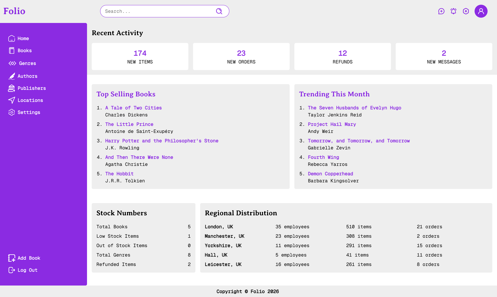
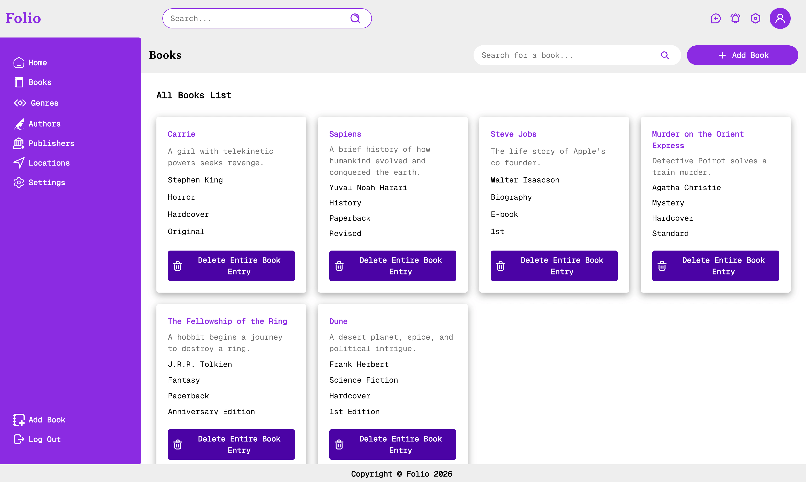
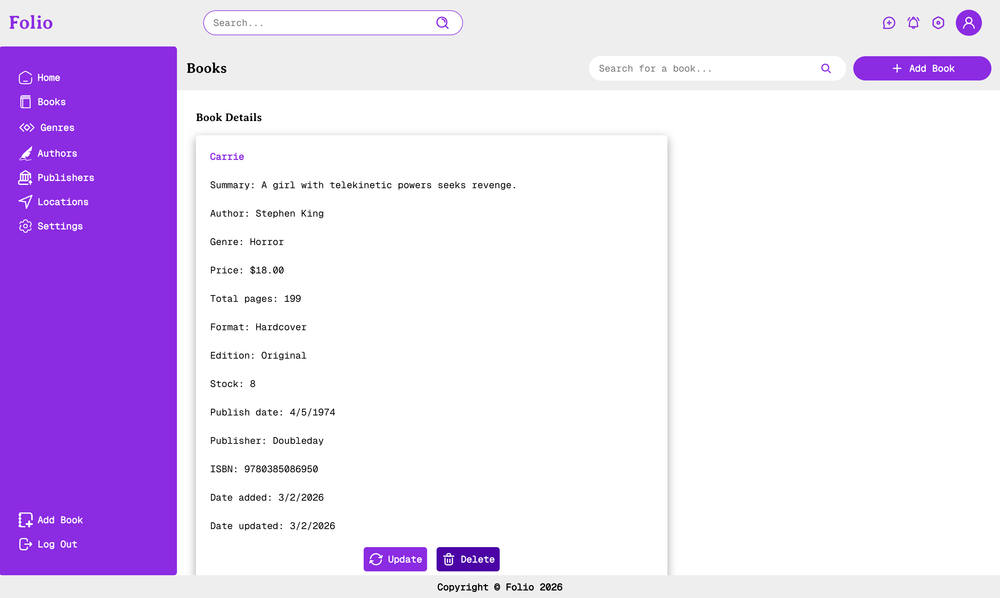
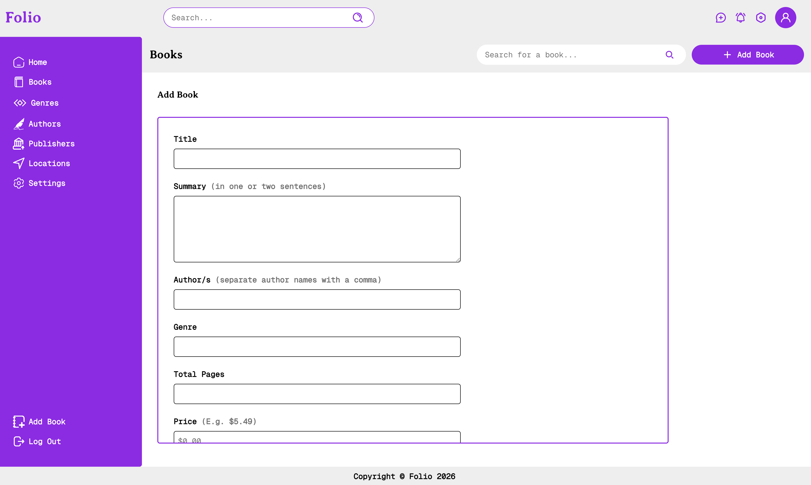
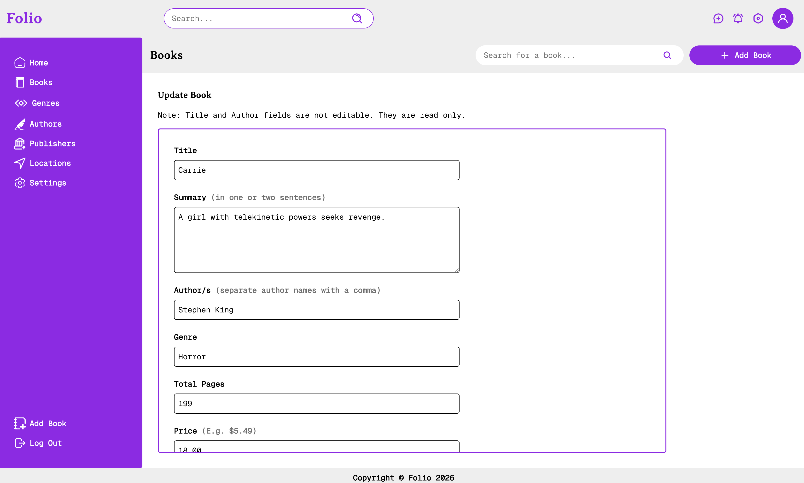
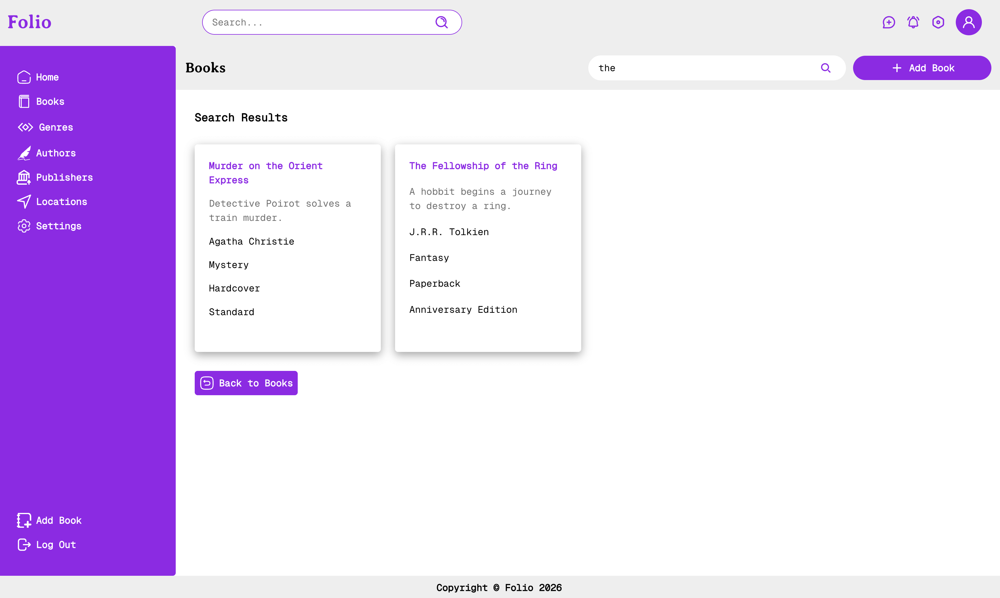

# Project: Inventory Application

This is a solution to the [Inventory Application Project](https://www.theodinproject.com/lessons/node-path-nodejs-inventory-application) as part of The Odin Project curriculum. 

## Table of contents

- [Project: Inventory Application](#project-inventory-application)
  - [Table of contents](#table-of-contents)
  - [Overview](#overview)
    - [Features](#features)
    - [Screenshots](#screenshots)
    - [Links](#links)
  - [Credits](#credits)
    - [Icons](#icons)
    - [Fonts](#fonts)
    - [Useful resources](#useful-resources)

## Overview

This is a simple inventory application that allows users to manage books inventory. The application is built using Node.js, Express, and EJS and it uses a PostgreSQL database to store the data.

The application has the following sections: Home page, Books, Authors, Genres, and Publishers. And for each section you can add, edit, delete and view the data (CRUD). For example books section has the following features: Add a new book, Edit a book, Delete a book, View all books, View a specific book, and Search for a book. You can do this for authors, genres, and publishers as well.

### Features

- Adding multiple authors for a book is supported.
- When you add a book it is saved as a book copy and you can have multiple copies of the same book. 
- You can choose to delete entire book entry which will delete all the book copies or you can delete a specific book copy.
- When you update a book, book title and author will not be editable but you can update all other data about the book.
- Duplicate entries for authors, genres, and publishers are not allowed. Also you can not have two books with the same title and author/s.

### Screenshots

<table>
  <tr>
    <td align="center">
      
       
      <em>Homepage </em>
    </td>
    <td align="center">
      
       
      <em>Books </em>
    </td>
  </tr>
  <tr>
    <td align="center">
      
       
      <em>Book details</em>
    </td>
    <td align="center">
      
       
      <em>Add book</em>
    </td>
  </tr>
  <tr>
    <td align="center">
      
       
      <em>Update book</em>
    </td>
    <td align="center">
      
       
      <em>Search results</em>
    </td>
  </tr>
</table>

### Links

- [Solution URL](https://github.com/py-code314/inventory-application)
- [Live Site URL](https://inventory-application.onrender.com/)

## Credits

### Icons

- All icons are from [SVG Repo](https://www.svgrepo.com/) 

### Fonts

- Averia Serif Libre & Geist Mono fonts are downloaded from [Google Fonts](https://fonts.google.com/)
- All fonts are converted using [Font Squirrel Webfont Generator](https://www.fontsquirrel.com/tools/webfont-generator)

### Useful resources

- Naming strategy for CSS variables is from this Medium [article](https://medium.com/design-bootcamp/simple-design-tokens-with-css-custom-properties-7ab69b71d8ad)
- Box shadows generator - [getcssscan.com](https://getcssscan.com/css-box-shadow-examples)
- PostgreSQL [tutorial](https://neon.com/postgresql/tutorial)

